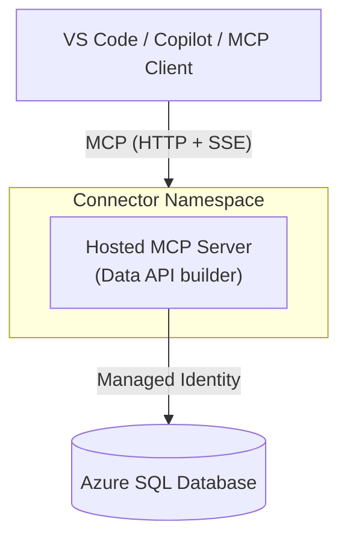

# Hosted MCP in Connector Namespace — Azure SQL Database

This sample deploys a hosted Model Context Protocol (MCP) server in [Azure Connector Namespace](https://learn.microsoft.com/azure/logic-apps/connector-namespace/connector-namespace-hosted-mcp), backed by Azure SQL Database. It uses [Azure Developer CLI](https://learn.microsoft.com/azure/developer/azure-developer-cli/) (`azd`) and Bicep to provision the infrastructure, seed a sample `dbo.BlogPosts` table through a post-provision SQL script, and configure managed identity access. After deployment, MCP clients such as GitHub Copilot in Visual Studio Code can query the database through the hosted MCP server.

<a name=before-you-begin></a>

## Before you begin

To run this sample, you need the following prerequisites.

**Software prerequisites:**

1. [Azure CLI](https://learn.microsoft.com/cli/azure/install-azure-cli) (`az`)
1. [Azure Developer CLI](https://learn.microsoft.com/azure/developer/azure-developer-cli/install-azd) (`azd`)
1. PowerShell 7+ on Windows, or Bash on Linux/macOS
1. [Visual Studio Code](https://code.visualstudio.com/) with the [GitHub Copilot](https://marketplace.visualstudio.com/items?itemName=GitHub.copilot) extension (to connect to the deployed MCP server)

**Azure prerequisites:**

1. An Azure subscription with permissions to create resource groups and resources.
1. Permission to create Azure SQL Database, Application Insights, Log Analytics workspace, and Connector Namespace resources.
1. Permission to create an Azure SQL Database Microsoft Entra ID administrator for the signed-in user.

<a name=run-this-sample></a>

## Run this sample

From this folder:

```bash
azd auth login
azd init
azd up
```

> **Cross-platform:** `azd up` works on Windows (runs the PowerShell post-provision hook), macOS, and Linux (runs the Bash post-provision hook). No additional tools are required beyond the prerequisites listed above. A standalone `deploy.ps1` script is also included as an alternative for PowerShell users.

#### `azd init` prompts

When you run `azd init` for the first time, it detects the existing `azure.yaml` and Bicep templates:

1. **"How do you want to initialize your app?"** — Select **Use code in the current directory**.
2. **"Confirm and continue initializing this app"** — Press **Enter** to confirm the detected services.
3. **"Enter a new environment name"** — Pick any name, for example `mcp-dev`. This name is used as a prefix for Azure resource names.

You only need to run `azd init` once. Subsequent deployments only require `azd up`.

#### `azd up` prompts

When you run `azd up`, you are prompted for:

- **Azure Subscription:** Select the Azure subscription to deploy to.
- **Azure location:** Choose a supported region (e.g. `eastasia`, `westcentralus`).
- **`deployerLoginName` infrastructure parameter:** Enter your Azure sign-in email or user principal name, for example `user@contoso.com`. If you don't know the value, run the following command in a different terminal instance and use the result:

  ```bash
  az account show --query user.name -o tsv
  ```
- **`connectorNamespaceIdentityType` infrastructure parameter:** Enter `SystemAssigned` for the default Connector Namespace managed identity, or `UserAssigned` to create and attach a user-assigned managed identity.

The `deployerLoginName` value is used to create the Azure SQL Database server with Microsoft Entra ID-only authentication and set you as the SQL admin.

### Optional: use a user-assigned managed identity

When `azd up` prompts for `connectorNamespaceIdentityType`, enter `UserAssigned` to test with a user-assigned managed identity.

When set to `UserAssigned`, the template creates a user-assigned managed identity, attaches it to the Connector Namespace, passes its client ID to the hosted MCP server, and grants that identity access to Azure SQL Database.

Choose the identity type before the first deployment. Connector Namespace doesn't allow changing attached user-assigned identities after the namespace is created. To switch between `SystemAssigned` and `UserAssigned`, create a new azd environment or run `azd down --purge` and deploy again.

For more information about managed identity options in Azure Connector Namespace, see [Hosted MCP servers in Azure Connector Namespace](https://learn.microsoft.com/azure/logic-apps/connector-namespace/connector-namespace-hosted-mcp).

### Connect from Visual Studio Code

After `azd up` completes, the MCP endpoint URL is printed. Add it to VS Code using the UI. For full details, see the [VS Code MCP servers documentation](https://code.visualstudio.com/docs/copilot/chat/mcp-servers).

1. In VS Code, open the Command Palette:
   - Windows/Linux: <kbd>Ctrl</kbd>+<kbd>Shift</kbd>+<kbd>P</kbd>
   - macOS: <kbd>Cmd</kbd>+<kbd>Shift</kbd>+<kbd>P</kbd>
1. Run **MCP: Add Server**.
1. Choose **HTTP** as the server type.
1. Paste the MCP endpoint URL printed by `azd up`.
1. Enter a server name, for example `sql-mcp`.
1. Choose whether to save the server in user settings or workspace settings.
1. Start the `sql-mcp` server when VS Code prompts you.

VS Code prompts you to sign in with Microsoft.

### Try it out

Once the MCP server is connected in VS Code, open Copilot Chat (Agent mode) and try prompts like:

- *"List the blog posts in the database."*
- *"What tables are available?"*
- *"Show me the blog post from the .NET Blog."*

Copilot uses the MCP tools (`describe_entities`, `read_records`) exposed by Data API builder to query Azure SQL Database and return results.

<a name=sample-details></a>

## Sample details

### Architecture



### Resources deployed

| Resource | Purpose |
|----------|---------|
| **Resource Group** | Logical container for all deployed resources |
| **Azure SQL Database logical server** | Microsoft Entra ID-only authentication, with you as the server admin |
| **Azure SQL Database** | Basic SKU database with a seeded `dbo.BlogPosts` sample table used by the MCP server |
| **SQL Firewall Rules** | Allows Azure services/resources, Azure Portal Query Editor, and your public IP for setup |
| **Log Analytics Workspace** | Stores Application Insights telemetry |
| **Application Insights** | Collects telemetry from the hosted MCP server |
| **Connector Namespace** | Hosts MCP servers with system-assigned managed identity by default, or user-assigned managed identity when configured |
| **Hosted MCP server** | Data API builder MCP server configuration deployed to the Connector Namespace |
| **MCP Access Policy** | Grants you access to invoke MCP tools |

Resource names use the pattern `<type>-<environment-name>-<short-suffix>` where possible, for example `sql-mcp-dev-a1b2c3d4`. The suffix is deterministic for the subscription, environment name, and location so names are readable and stable across redeployments.

### What `azd up` does

| Step | Action |
|------|--------|
| **Provision** | Deploys Azure SQL Database, SQL firewall rules, Log Analytics, Application Insights, Connector Namespace, hosted MCP server, and MCP access policy. |
| **Post-provision** | Allows your public IP through the SQL firewall, creates and seeds `dbo.BlogPosts`, creates the Connector Namespace managed identity SQL user, grants SQL permissions, generates `dab-config.generated.json`, and prints the MCP endpoint plus Azure Portal resource group link. |

The hosted MCP server receives:

- the included `dab-config.json` (the Data API builder configuration file) as `properties.hostedMcpServer.configuration.configFile`
- the generated connection string as `SQL_CONNECTION_STRING`
- the Application Insights connection string as `APPLICATIONINSIGHTS_CONNECTION_STRING`
- `AZURE_CLIENT_ID` when the sample is configured to use a user-assigned managed identity

No database or Application Insights connection strings are checked in.

This sample includes a ready-to-use `dab-config.json`, the Data API builder configuration file that defines which database entities are exposed through MCP tools. If you want to create or customize a Data API builder configuration from scratch, install the DAB CLI and use it to generate a config file. For more information, see [Install the Data API builder CLI](https://learn.microsoft.com/azure/data-api-builder/command-line/install).

For details about the hosted MCP server resource model and supported server types, see [Hosted MCP servers in Azure Connector Namespace](https://learn.microsoft.com/azure/logic-apps/connector-namespace/connector-namespace-hosted-mcp). For a walkthrough focused on the Azure SQL Database hosted MCP server, see [Hosted MCP server quickstart for SQL](https://learn.microsoft.com/azure/logic-apps/connector-namespace/hosted-mcp-quickstart?pivots=sql).

### Inspect resources in Azure Portal

After deployment, the post-provision output includes a link to the Azure resource group in the Azure Portal. Use that page to inspect the Azure SQL Database logical server, Application Insights resource, Log Analytics workspace, Connector Namespace, and hosted MCP server.

To allow additional users to connect to the MCP server:

1. Open the deployed **Connector Namespace** resource in the Azure Portal.
1. Open the hosted MCP server configuration, for example `sql-mcp`.
1. Add an access policy for each additional user or group that should be allowed to invoke the MCP server.

### Sample data

The post-provision hook creates and seeds `dbo.BlogPosts` with these entries:

| Title | Source |
|-------|--------|
| Hosted MCP servers in Azure Connector Namespace | Microsoft Learn |
| Durable Workflows in Microsoft Agent Framework | .NET Blog |

### SQL firewall access

The deployment configures two SQL firewall paths:

| Rule | When | Purpose |
|------|------|---------|
| `AllowAzureServices` | During Bicep provisioning | Allows Azure services/resources, including Azure Portal Query Editor, to reach the SQL server. |
| `AllowDeployerIp` | During post-provision | Detects your current public IP and allows your local machine to seed and query the database. |

If SQL reports a different blocked client IP during post-provision, the script adds that IP and retries.

<a name=clean-up></a>

## Clean up

Using azd:

```bash
azd down --purge
```

Or with Azure CLI:

```bash
# Replace <environment-name> with your azd environment name.
az group delete --name rg-<environment-name> --yes --no-wait

# Optional: remove the subscription-scope deployment record.
az deployment sub delete --name <environment-name>
```

<a name=related-links></a>

## Related links

- [Hosted MCP servers in Azure Connector Namespace](https://learn.microsoft.com/azure/logic-apps/connector-namespace/connector-namespace-hosted-mcp)
- [Hosted MCP server quickstart for Azure SQL Database](https://learn.microsoft.com/azure/logic-apps/connector-namespace/hosted-mcp-quickstart?pivots=sql)
- [Azure SQL Database MCP server support in Data API builder](https://learn.microsoft.com/azure/data-api-builder/mcp/overview)
- [Install the Data API builder CLI](https://learn.microsoft.com/azure/data-api-builder/command-line/install)
- [Connector Namespace overview](https://learn.microsoft.com/azure/logic-apps/connector-namespace/connector-namespace-overview)
- [Azure Developer CLI](https://learn.microsoft.com/azure/developer/azure-developer-cli/)
